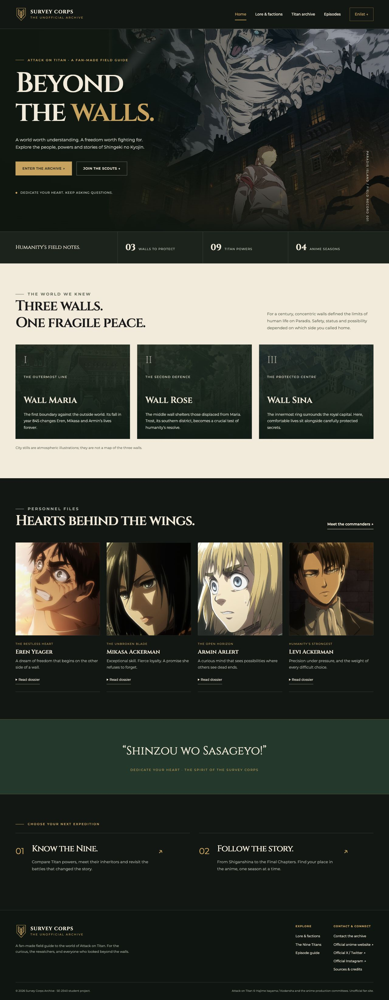
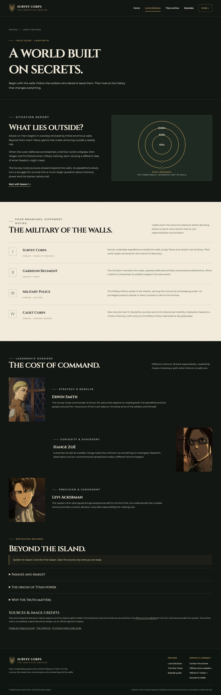
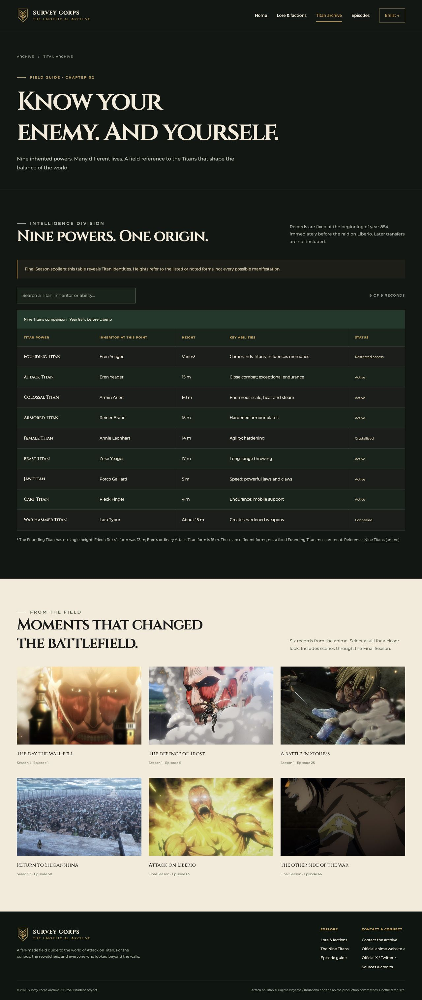
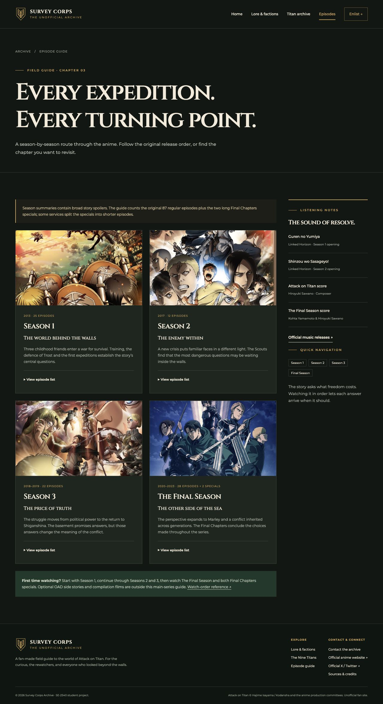
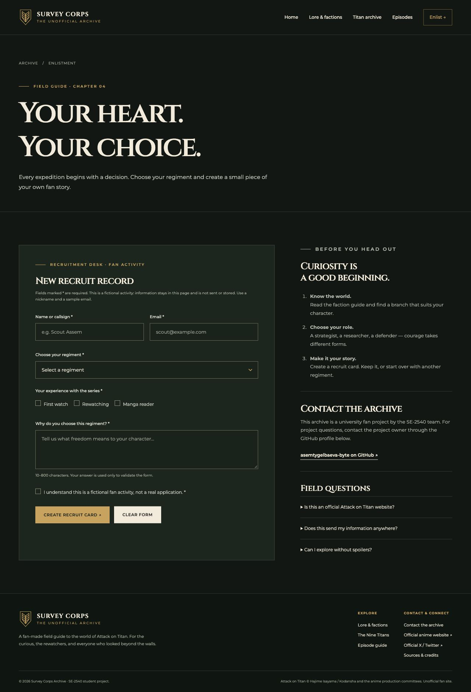
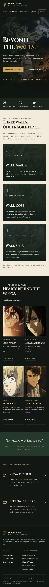

# Survey Corps Archive — Attack on Titan Fan Website

**Website:** [Open Survey Corps Archive](https://asemtygelbaeva-byte.github.io/survey-corps-archive/)

**Course:** Web Technologies — Midterm Project, 2026  
**Group:** SE-2540  
**Project format:** Group project  
**Team:** Assem Tugelbay, Zhansaya Boranbaikyzy, Alina Ibadulla

## Project idea

Survey Corps Archive is a fan website about _Attack on Titan / Shingeki no Kyojin_. It covers the story, military factions, characters, Titan powers and seasons. The green, gold and parchment colours are inspired by the Survey Corps and military records.

## Pages and features

| Page                           | Content and implementation                                                                                                              |
| ------------------------------ | --------------------------------------------------------------------------------------------------------------------------------------- |
| [Home](index.html)             | Cinematic hero, three wall cards, four character dossiers, Flexbox navigation and CSS Grid sections                                     |
| [Lore & factions](about.html)  | World introduction, accessible wall diagram, military list, alternating commander rows and expandable spoiler records                   |
| [Titan archive](titans.html)   | Nine-row comparison table, live search, empty-result state and six-image battle gallery with a native dialog viewer                     |
| [Episode guide](episodes.html) | Four Bootstrap season cards, expandable episode lists, episode ranges and a sticky music/sidebar section                                |
| [Enlistment](join.html)        | Labelled form with required fields, email validation, select, radios, checkbox, textarea, reset and downloadable fictional recruit card |

The Titan table is a snapshot of **year 854, before the raid on Liberio**. This avoids mixing inheritors from different points in the story. The episode guide counts 87 regular episodes and two long Final Chapters specials; platforms may divide the specials differently.

## Technologies

- Semantic HTML5 with a header, navigation, main and footer on every page.
- External stylesheets: `css/style.css` and locally hosted Google Font definitions in `css/fonts.css`.
- **Bootstrap 5.3.8**, stored in `vendor/`. The episode cards use `.row`, `.col-md-6`, `.g-4`, `.card` and `.h-100`; forms and other sections use Bootstrap spacing, button, form and alignment utilities.
- CSS Flexbox, CSS Grid, custom properties, relative/absolute positioning and sticky navigation/sidebar.
- JavaScript for the menu, search, dialog and browser-only recruit-card activity.
- Locally stored Cinzel and Montserrat fonts, including their open font licences.

## Layout

| Feature                                    | Implementation                                                                    |
| ------------------------------------------ | --------------------------------------------------------------------------------- |
| At least five linked pages                 | Five HTML files; shared `.site-nav`                                               |
| Semantic headings, lists, links and images | All pages; military list on `about.html`                                          |
| Table                                      | `.titan-table` on `titans.html`, with caption and scoped headers                  |
| Form                                       | `#recruit-form` on `join.html`, with explicit labels and native constraints       |
| External CSS; no internal or inline styles | `css/style.css`; all styles are external                                          |
| At least three variables in `:root`        | `--forest`, `--gold`, `--ink`, `--paper`, typography and spacing variables        |
| Flexbox                                    | `.header-inner`, `.site-nav`, card content and action rows                        |
| Grid                                       | `.walls-grid`, `.character-grid`, `.gallery-grid`, page layouts                   |
| Positioning                                | `.hero` and `.hero-art` use relative/absolute; `.sticky-sidebar` uses sticky      |
| `:hover` and `:focus`                      | Buttons, navigation, gallery and dossier links; visible keyboard focus            |
| `:nth-child()`                             | Alternating table rows and commander layouts                                      |
| Google Fonts / self-hosted font            | Local Cinzel and Montserrat in `assets/fonts/`                                    |
| Lazy images                                | Below-the-fold character, wall, commander, gallery and season images              |
| Two responsive breakpoints                 | Desktop-first custom media queries at 991px and 640px, alongside Bootstrap’s grid |
| Contact, copyright and social links        | Shared footer; contact section on `join.html`                                     |
| Online publication                         | GitHub Pages, linked above                                                        |

## Team responsibilities

Planned division of work:

| Member                | Area                                                                                |
| --------------------- | ----------------------------------------------------------------------------------- |
| Assem Tugelbay        | Home page, shared header/footer, visual system, CSS variables and final integration |
| Zhansaya Boranbaikyzy | Lore/factions page, Titan comparison, gallery, story references and asset credits   |
| Alina Ibadulla        | Bootstrap episode page, enlistment form, browser interactions and responsive checks |

## Screenshots

### Home

### Lore and factions

### Titan archive

### Episode guide

### Enlistment

### Mobile view

## Testing

The pages were checked at desktop, tablet and mobile widths (1280px, 768px and 390px). Navigation, image viewers, Titan search, episode lists and form validation were tested. Links and local assets were also checked.

## Form behaviour

The enlistment form creates a fictional recruit card in the browser. The card can be downloaded as a text file with the entered name and regiment. The form has no backend: the email and message are not sent or saved.

## Assets and references

- [Complete image credits](ASSET_SOURCES.md). Artwork and characters belong to their original rights holders; this is an unofficial educational project.
- [Official Attack on Titan website](https://shingeki.tv/).
- [Nine Titans reference](<https://attackontitan.fandom.com/wiki/Nine_Titans_(Anime)>).
- [Crunchyroll watch-order guide](https://www.crunchyroll.com/news/guides/2023/3/1/guide-attack-on-titan-watch-order).
- [Bootstrap documentation](https://getbootstrap.com/docs/5.3/), [MIT licence](vendor/bootstrap.LICENSE).
- [Cinzel licence](assets/fonts/Cinzel-OFL.txt), [Montserrat licence](assets/fonts/Montserrat-OFL.txt).
